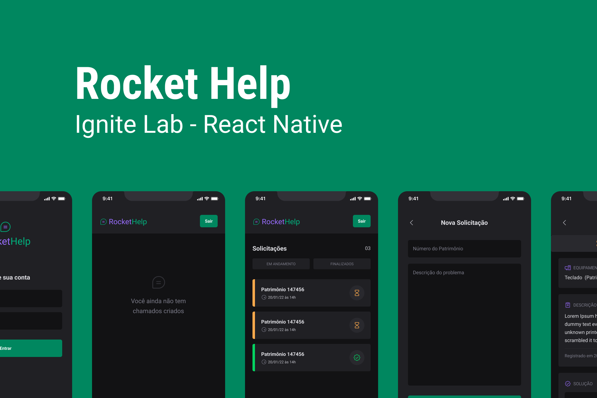

# RocketHelp

# Rocketseat Ignite Lab React Native

Evento da [Rocketseat](https://www.youtube.com/c/RocketSeat). Aplicativo para controle de solicitações de ajuda.

## Tech Stack

- [React](https://reactjs.org)
- [React Native](https://reactnative.dev)
- [TypeScript](https://www.typescriptlang.org)
- [Expo](https://expo.dev)
- [React Navigation](https://reactnavigation.org)
- [Native Base](https://nativebase.io)
- [React Hook Form](https://react-hook-form.com)
- [Firebase](https://firebase.google.com)

## Alterações Minhas Incluem

- Tela de cadastro do usuário.
- Filtro para visualizar somente solicitações do usuário logado.
- Alterar Tela de Detalhes da solicitação para atualizar em tempo real.
- Mais interação com formulário e melhorar feedback.
